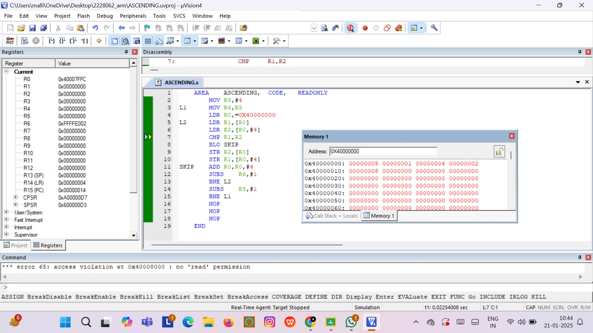
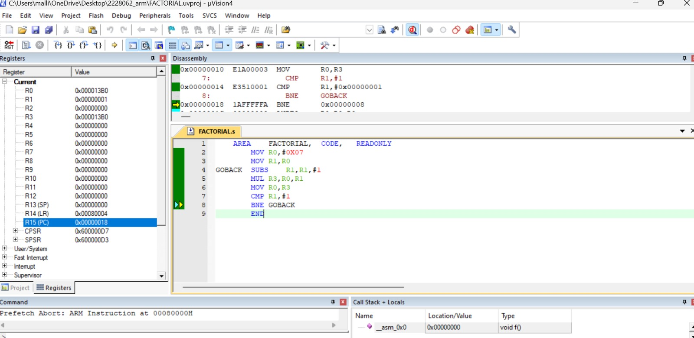

# ARM7-RISC-LAB
ARM7 assembly programs built and simulated in Keil μVision. Includes sorting, factorial, array ops, and register tasks.
# ARM7 & RISC Assembly Lab Projects 🎓

This repository contains ARM7TDMI assembly programs developed as part of my 5th semester coursework in **ARM and Advanced Processors** (EC3031) at KIIT University, Bhubaneswar. I have successfully completed lab-based exercises covering a range of ARM7 instructions and concepts, and secured the highest grade **“O” (Outstanding)** in this course.

## 📚 Topics Studied

As per the official lesson plan, the following concepts were studied:

- RISC design philosophy and ARM architecture
- ARM processor fundamentals: Registers, CPSR, Memory map
- Pipeline execution, interrupts, and vector table
- Instruction set and Thumb instructions
- Practical implementation using Keil μVision4

## 💡 Programs Included

- **Ascending Sort**
- **Factorial**
- **Transfer**
- **Array Minimum**
- **Counting Zeros and Ones**

## 🖥️ Tools Used

- Keil μVision4 IDE  
- ARM7TDMI-S Emulator  
- Windows 11

## 🖼️ Screenshots

All simulations are documented with screenshots stored in the `/screenshots` folder.

## 📸 Keil Simulation Outputs

### 🟦 1. Ascending Sort (Memory Order)

---

### 🟨 2. Factorial Program Output

---

### 🟩 3. Bit Counting: Zeros and Ones

---

### 🟥 4. Array Minimum Finder

